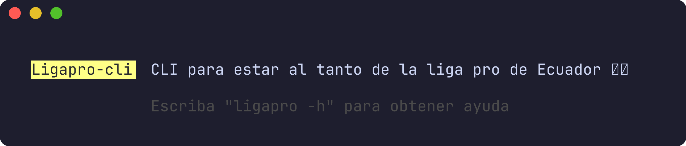
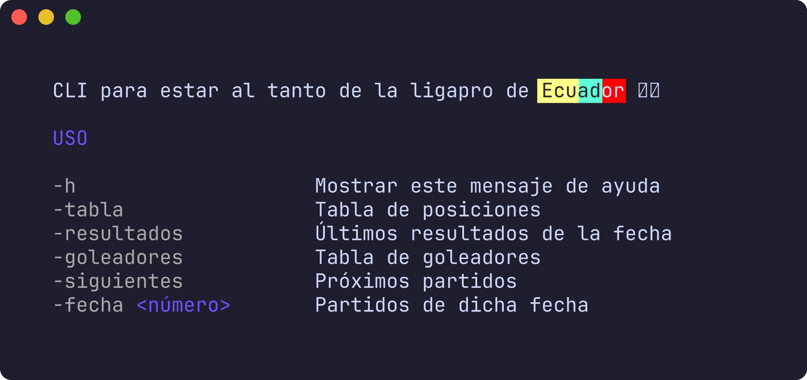
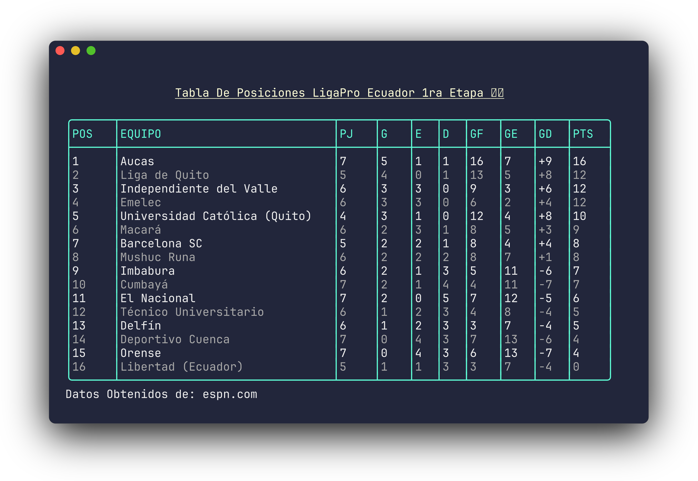
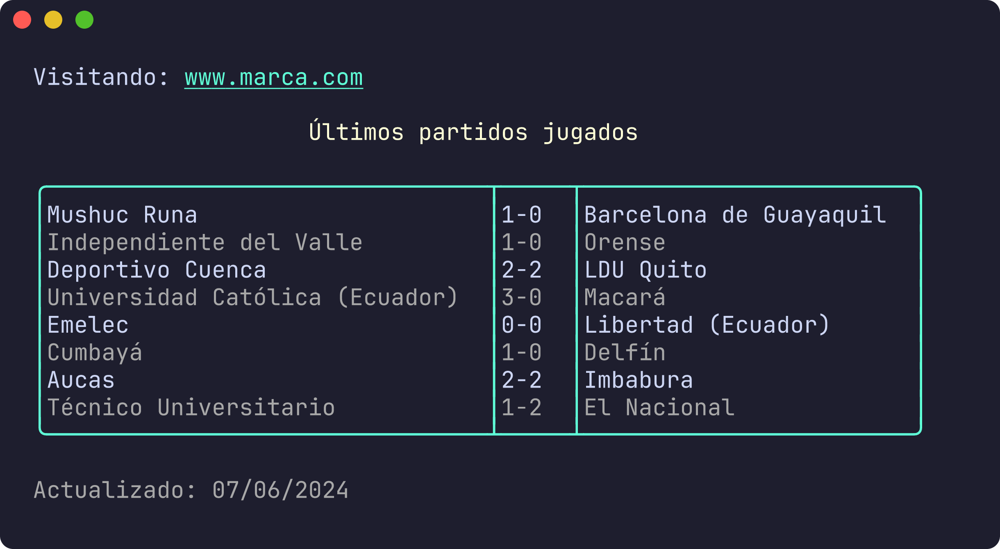
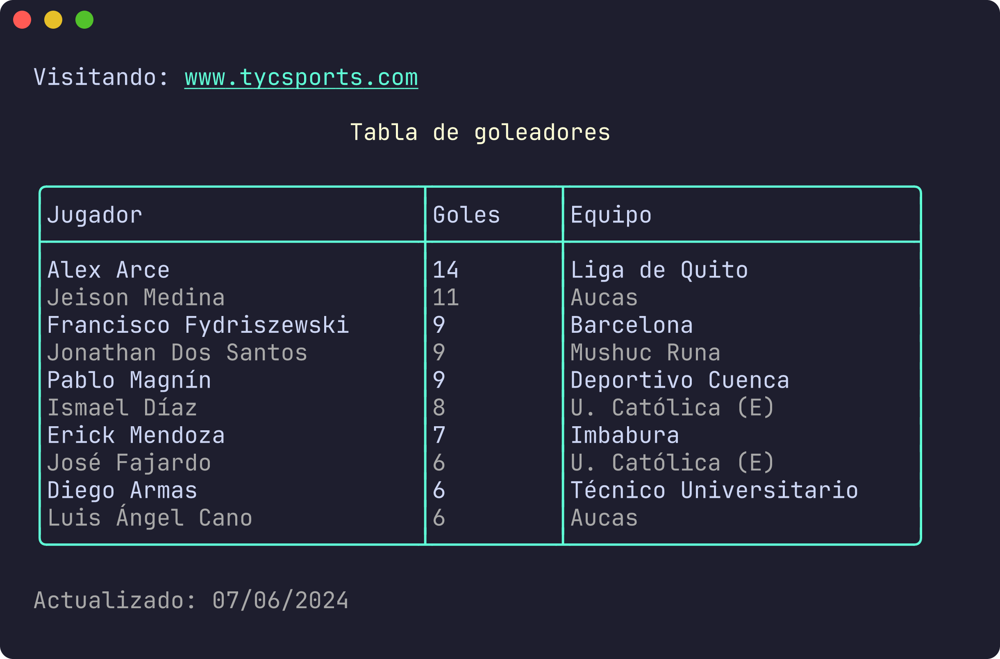
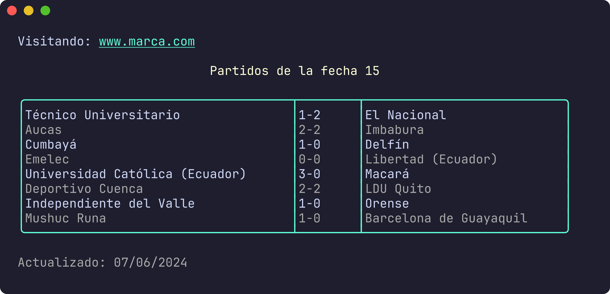

# ligapro-cli

 

ligapro-cli es un programa de terminal para estar al tanto de la serie A de Ecuador, también llamada LigaPro.  
Los datos actualizados son obtenidos de:
  
- [espn.com](https://www.espn.com/soccer/league/_/name/ecu.1).  
- [marca.com](https://www.marca.com/futbol/ecuador/primera-etapa/calendario.html)
- [tycsports.com](https://www.tycsports.com/estadisticas/futbol-de-ecuador/tabla-de-goleadores.html)
  
* Para el Web Scraping se uso el framewok [colly](https://go-colly.org/) 🌐
* Para la interfaz se terminal se uso el framewok [lipgloss](https://github.com/charmbracelet/lipgloss) 💻

## Instalación 
Con go instalado, usar el comando:
```bash
go install -o ligapro github.com/Luiggy102/ligapro-cli@latest
```
### Uso
Mostar las opciones con `-h`
```bash
ligapro -h
```
 

Mostar la tabla actual de posiciones con `-tabla`
```bash
ligapro -tabla
```
 

Mostar los últimos resultados de la presente fecha con `-resultados`
```bash
ligapro -resultados
```
 

Mostrar la tabla actual de goleadores con `-goleadores`
```bash
ligapro -goleadores
```
 

Buscar los partidos según su fecha con `-fecha <número-del-partido>`
```bash
ligapro -fecha 15
```
 
